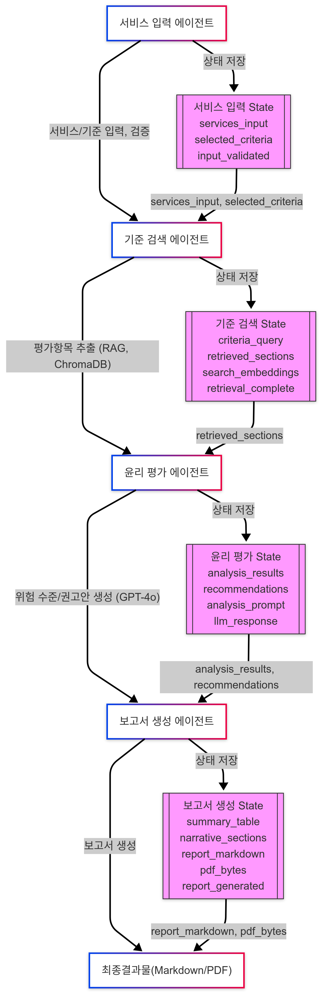

# AI 윤리성 리스크 진단 시스템

## 프로젝트 개요
이 프로젝트는 AI 서비스의 윤리적 리스크를 자동으로 진단하고 평가하는 시스템입니다. 주요 AI 윤리 프레임워크(EU AI Act, UNESCO AI Ethics, OECD AI Principles)를 기반으로 서비스를 분석하고, 잠재적인 윤리적 문제점을 식별하며, 개선 방안을 제시합니다.

## 주요 기능
- 다중 AI 서비스 동시 분석
- 주요 윤리 프레임워크 기반 평가
- 자동화된 리스크 평가 및 점수 산정
- 상세한 분석 보고서 자동 생성
- 개선을 위한 구체적인 권고사항 제시

## 기술 스택
| 구분 | 기술 |
|------|------|
| 프레임워크 | LangChain, Python |
| LLM | GPT-4 |
| 벡터DB | FAISS, ChromaDB |
| 저장소 | JSON, Markdown |

## 에이전트 구성
1. 서비스 입력 에이전트: 사용자로부터 입력받은 AI 서비스(JSON)와 선택된 윤리 기준을 수집하고 초기 상태로 설정합니다.
2. 기준 검색 에이전트: 선택된 윤리 기준(예: EU AI Act, UNESCO, OECD)의 원문이 저장된 ChromaDB에서, 각 서비스 설명에 맞는 평가 항목(조항)을 벡터 검색으로 추출합니다.
3. 윤리 평가 에이전트: GPT-4o를 사용해 추출된 평가 항목을 기반으로 각 서비스의 위험 수준을 분석하고, 서비스-항목 쌍별로 리스크를 요약합니다.
4. 보고서 생성 에이전트: 분석 결과를 받아 Jinja2 템플릿에 삽입하여 최종 Markdown 보고서를 만듭니다. 보고서는 요약 표와 항목별 권고안을 포함하며, 필요 시 PDF로 변환됩니다.

## Agent별 State
**서비스 입력 에이전트**
| 키                   | 설명                                               |
| ------------------- | ------------------------------------------------ |
| `services_input`    | 사용자로부터 입력받은 AI 서비스 목록 및 세부 정보(JSON)              |
| `selected_criteria` | 사용자가 선택한 윤리 기준 목록 (예: `["EU AI Act", "UNESCO"]`) |
| `input_validated`   | 입력 데이터 검증 여부 (필수 필드 존재 여부, JSON 파싱 등)            |

**기준 검색 에이전트**

| 키                    | 설명                                         |
| -------------------- | ------------------------------------------ |
| `criteria_query`     | 각 서비스 설명에 기반해 생성된 검색 쿼리(문장 or 키워드)         |
| `retrieved_sections` | ChromaDB에서 반환된 관련 평가 항목(윤리 기준 텍스트 조각)의 리스트 |
| `search_embeddings`  | 검색용 쿼리 문장에 대한 임베딩 결과 (Vector)              |
| `retrieval_complete` | 기준 검색 완료 여부 (Boolean)                      |

**윤리 평가 에이전트**
| 키                  | 설명                                       |
| ------------------ | ---------------------------------------- |
| `analysis_results` | 각 서비스-평가항목 쌍에 대한 위험 수준(높음/중간/낮음) 및 간략 설명 |
| `recommendations`  | 각 서비스-평가항목에 대한 서술형 개선 권고안 (자연어 텍스트)      |
| `analysis_prompt`  | 내부적으로 사용된 분석용 프롬프트 템플릿 (디버깅용)            |
| `llm_response`     | GPT-4o로부터 받은 원본 응답 내용 (RAW)              |

**보고서 생성 에이전트**
| 키                    | 설명                                   |
| -------------------- | ------------------------------------ |
| `summary_table`      | 보고서에 포함될 요약 표 데이터 (서비스, 평가항목, 위험 수준) |
| `narrative_sections` | 보고서에 포함될 항목별 권고안 텍스트 (마크다운 형식의 단락)   |
| `report_markdown`    | 최종 결합된 전체 보고서 내용 (Markdown 포맷)       |
| `pdf_bytes`          | 보고서의 PDF 변환 결과 (바이트 스트림)             |
| `report_generated`   | 보고서 생성 완료 여부 (Boolean)               |


## 상태 관리
- 워크플로우 상태 추적
- 서비스 데이터 관리
- 리스크 점수 기록
- 권고사항 저장
- 보고서 상태 관리

## 아키텍처



## 디렉토리 구조
```
ai_agent/
├── src/
│   ├── agents/           # 에이전트 구현
│   ├── core/            # 핵심 기능
│   ├── prompts/         # 프롬프트 템플릿
│   ├── tools/           # 유틸리티 도구
│   └── utils/           # 유틸리티 함수
├── outputs/
│   ├── reports/         # 생성된 보고서
│   └── states/          # 시스템 상태
├── tests/               # 테스트 코드
├── config/              # 설정 파일
├── main.py             # 메인 실행 스크립트
└── requirements.txt     # 의존성 패키지
```

## 기여자
- 고동현: Prompt Engineering, Agent Design